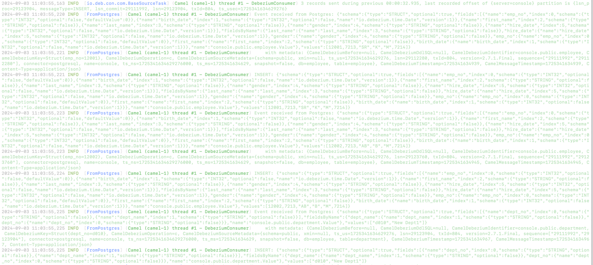

# Debezium-Postgres-Camel-Extension

Welcome to the magical land of database change data capture (CDC), where we take the mundane task of tracking Postgres changes and make it as entertaining as binge-watching cat videos. This repository contains an extension of the Debezium Postgres Connector, cleverly designed to make your data pipelines run smoother than your morning coffee.

## What's in the Box?

This project extends the Debezium Postgres Connector using Apache Camel, enabling you to effortlessly capture database changes, log them with style, and do it all with a smirk on your face.

## Pre-requisites

Before you dive into this wild ride, make sure you have the following:

- **Java 21+**: Because we're fancy like that.
- **Apache Maven 3.8.8**: To build and package your dreams.
- **PostgreSQL 16**: The trusty old friend that we're listening to.
- **Quarkus**: Because we like things fast and lean.

## How to Get Started

1. **Clone the Repo**:
```
git clone https://github.com/rajat965ng/debezium-postgres-camel-extension.git

cd debezium-postgres-camel-extension
```

2. **Compile the Code**:
```
mvn clean install
```
If everything works fine, you'll be rewarded with a freshly baked jar file in the target directory.

3. **Run the Application**:
```
java -jar target/quarkus-app/quarkus-run.jar
```
Sit back, relax, and watch as your database changes get logged like they're in a reality TV show.

## JSON Output



## Why Use This?

- **Because Logs Are Life**: You'll know exactly what's happening in your database, down to the tiniest insert, update, or delete.
- **Because It's Fun**: Who says CDC can't be entertaining?
- **Because It Works**: Reliable, extendable, and ready to make your life easier.

## Contributing
If you think you can make this even more fun, feel free to fork, extend, and send a pull request.


## Let's Connect (Or Hire Me!)
If you find yourself hopelessly enchanted by this repository, or if you’re thinking, "This person should definitely be on my team," then we should chat. Whether it's to discuss this project, share some database gossip, or to offer me an exciting job (because who wouldn't want that?), you can connect with me on [LinkedIn](https://www.linkedin.com/in/rajat-nigam-877208127/).